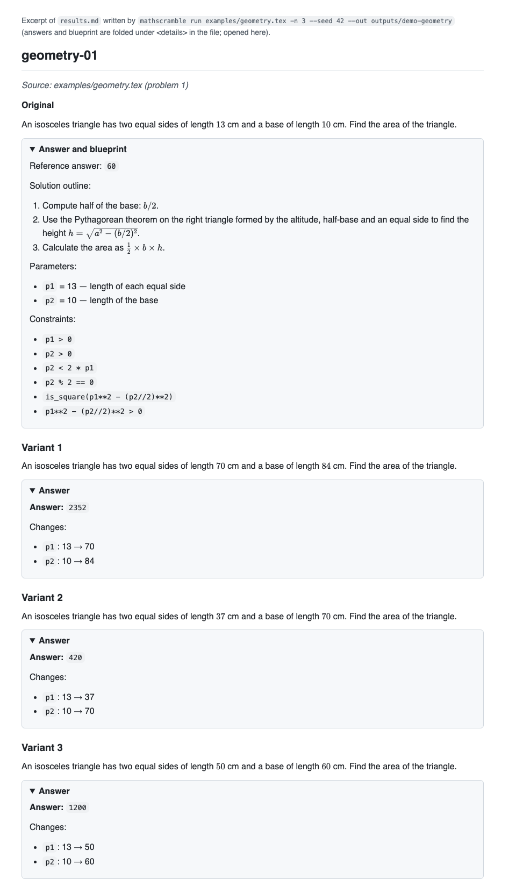

# MathScrambler

Turns one math problem into new problems that are solved the same way but use different numbers and a different story, with models that run entirely on your own machine.


## What it is for

Anyone who teaches, tutors, or studies mathematics runs out of fresh problems of a given type: a textbook has one "two taps fill a tank" problem, and a student who has seen its answer needs another one that exercises exactly the same reasoning. Rewriting such problems by hand is slow, and asking a language model to "change the numbers" quietly produces problems that are no longer well-posed — triangles that cannot exist, answers that are ugly fractions, probabilities above one. MathScrambler generates variants that keep the original's solution method and answer type, with the new numbers chosen under the constraints the original problem implied and the new answer computed rather than guessed. It runs entirely on local models through Ollama, so problem sets never leave the machine.

## How it works

The generation is not a rewrite prompt. It is a pipeline in which a language model is asked for a *structure* and everything else is checked or computed by ordinary code.

### 1. A blueprint instead of a rewrite

The reasoning model turns a problem into a blueprint: a template with the scenery and the numbers pulled out into slots, a solution outline, a solver function, and a list of constraints the numbers must satisfy. This is the blueprint the pipeline extracted for the first problem in `examples/algebra.md`:

> A cinema sold 240 tickets for an evening screening. Adult tickets cost $12 each and child tickets cost $7 each, and the takings came to $2,330 in total. How many adult tickets were sold?

```
template     A {E1} sold {p1} tickets for an evening screening. {E2} cost ${p2} each and {E3} cost
             ${p3} each, and the takings came to ${p4} in total. How many {E2} were sold?
entities     E1 = cinema (place)   E2 = Adult tickets   E3 = child tickets
parameters   p1 = 240   p2 = 12   p3 = 7   p4 = 2330
constraints  p2 != p3
             (p4 - p3 * p1) % (p2 - p3) == 0
             0 <= (p4 - p3 * p1) // (p2 - p3) <= p1
solver       def solve(p1, p2, p3, p4): return (p4 - p3 * p1) // (p2 - p3)
```

The second constraint is the point of the whole design. The number of adult tickets is (takings − child price × total tickets) ÷ (adult price − child price), so for a variant to have a whole-number answer the numerator has to be divisible by the price gap. The model derived that relation from the problem, and the sampler enforces it on every draw. A number randomizer cannot know this; a blueprint makes it explicit and checkable. The third constraint keeps the answer between zero and the number of tickets sold, so the scenario stays possible.

A blueprint is not trusted. The code checks that every slot is used, that the constraints compile in a small expression language (comparisons, arithmetic, and a fixed set of helpers such as `divides`, `is_square`, `triangle`, `is_prime`), and that the solver's signature matches the parameters. Then the solver runs, in a sandboxed subprocess, on the original numbers and must reproduce the answer printed in the source when one is given. Any failure is sent back to the model with the full list of faults, up to three times.

### 2. Sampling, not asking

New numbers are drawn by seeded rejection sampling in plain Python, with no model involved: each draw stays in the original number's magnitude class, every number must change, every constraint must hold, the sandboxed solver computes the answer, and the answer must keep the original's shape (an integer stays an integer, a terminating decimal stays terminating). Degenerate answers — 0, 1, an answer equal to one of the inputs, a sign flip — are rejected. For the ticket problem 56 of the first 69 draws were rejected by the constraints; for an isosceles triangle whose area must stay a whole number, 482 of 495. The variant below came out of the cinema blueprint:

> A stadium sold 350 tickets for an evening screening. full-price tickets cost $47 each and discounted tickets cost $5 each, and the takings came to $4564 in total. How many full-price tickets were sold? — answer 67

The scenery (cinema → stadium, adult/child tickets → full-price/discounted tickets) is proposed by the small model and passed through a guard that rejects any swap that drops a mathematically loaded word ("square ABCD" may become "square PQRS", never "rectangle PQRS"), introduces a number, or leaves an entity unchanged. If the small model's proposals keep failing the guard, the reasoning model is asked instead; if nothing passes, the variant keeps its original scenery and the results say so.

The rendered output of a run, with the constraints that were enforced, looks like this:



### 3. Three model roles, one config file

`config.toml` assigns an Ollama tag to each of three roles; nothing is hard-coded.

| Role | Default | Why this model |
|---|---|---|
| `reasoner` | `gpt-oss:120b` (65 GB) | Writes the blueprint: the constraints and the solver need real mathematical reasoning. Runs at `reasoning_effort = "high"`; a blueprint takes 45–115 s on an M5 Max, almost all of it thinking. |
| `vision` | `qwen2.5vl:7b` (6 GB) | Reads problems out of page images. Chosen by test, not by spec sheet: the larger MLX tag that advertises vision confabulated whole pages at confidence 1.0, and its fallback read a figure's printed 9 and 12 as "3, 4, 5". The 7B model read all five example problems correctly, figure labels included. |
| `fast` | aliased to `vision` | Proposes replacement scenery in 3–4 s. Sharing the vision model keeps the resident footprint to two models. |

A `--lite` profile that swaps the reasoner for a 19 GB model exists in the config but **does not currently work** — see Project status. Any role can be overridden per run with `--models reasoner=<tag>`.

### 4. A private Ollama server that leaves the rest of the machine alone

The development machine runs a system-wide Ollama that other projects depend on, and that server keeps one model resident at a time. MathScrambler needs two models resident with a long keep-alive, and changing the global settings would change them for every other user of Ollama on the machine. So it does not. Instead:

- `mathscramble run` spawns its own `ollama serve` on `127.0.0.1:11435` (walking up to the next free port if that one is taken). The settings it needs — `OLLAMA_MAX_LOADED_MODELS=3`, `OLLAMA_NUM_PARALLEL=1`, `OLLAMA_KEEP_ALIVE=30m`, flash attention, a q8_0 KV cache — go into that child process's environment only; nothing is exported, no shell profile or `launchctl` variable is touched. Foreign `OLLAMA_*` variables are stripped from the child's environment except `OLLAMA_MODELS`, which is inherited so the private server shares the same model store as the global one: weights are downloaded once.
- The server's PID is recorded with its process create time, binary and port, and every signal MathScrambler ever sends requires all of those to match a live `ollama serve`. It cannot kill an Ollama process it did not start.
- Before loading anything, a memory gate projects the footprint of the roles that will be used and refuses if memory in use plus that projection would exceed 85% of physical RAM, naming what is using the memory and suggesting `--lite`. `mathscramble models --pull` refuses to download while another Ollama process on the machine is mid-pull, because two servers pulling the same blob can corrupt it.
- All state lives under `~/Library/Application Support/MathScrambler/`; everything listens on loopback only. Model-written solver code runs in a separate interpreter (`python -I`, an import allowlist, restricted builtins, no usable stdout, CPU and memory limits, a wall-clock kill) — a blast radius for careless code, not a security boundary against hostile code.

Verified during the live runs: both models resident on port 11435 while `ollama ps` on the global server stayed empty throughout, and `launchctl getenv OLLAMA_MAX_LOADED_MODELS` unset before and after.

### 5. Problems from images

A PNG or JPEG of a page goes to the vision model, normalized in memory only (EXIF rotation applied, converted to RGB, long side capped at 1600 px; the file is never rewritten). The model returns strict JSON: one entry per problem on the page, mathematics as LaTeX, a description of any figure, and the printed answer if there is one, kept separate from the statement so it never reaches the solver. A page with two problems yields two problems. Extractions the model rates below 0.7 confidence are flagged in the console. When a problem depends on a figure, the blueprint folds the figure's measurements into the text (the example right triangle became "side GH = 7 cm, side HI = 24 cm, and the right angle is at H"), since a variant has no figure.

## Usage

```bash
mathscramble run examples/ -n 3 --seed 42
```

`run` accepts any mix of files and folders: `.md`, `.txt`, `.tex`, `.json`, and images (`.png`, `.jpg`, …). Problems in text files are separated by a line of `---`; a printed answer goes in a comment (`<!-- answer: 130 -->` in Markdown, `% answer: 60` in LaTeX) so the model never sees it in the statement. The `examples/` folder holds twelve problems across every input type: seven in five text files and five on three page images. Options:

```
-n, --variants N      variants per problem (default 3, max 10)
--seed N              sampling seed; omitted = random, recorded in results.json for replay
--out DIR             output folder (default ./outputs/<timestamp>-<slug>/)
--lite                use the lite profile (wired, but see Project status)
--models role=tag,…   override a role's model for this run
```

Each run writes three files: `results.md` (original, variants, answers and the blueprint under `<details>` blocks), `results.json` (the full record, including parameter and scenery maps and sampling statistics), and `run.log` (every prompt and reply, truncated at 4K, with timings and the server used). The private server stays up after a run so the next one does not pay the model load again; it unloads idle models after the keep-alive.

```bash
mathscramble doctor           # environment report: Ollama, private server, models, memory, neighbours
mathscramble models           # configured roles: pulled? size? resident on which server?
mathscramble models --pull    # pull missing models (asks before anything over 30 GB)
mathscramble server status    # the private server (also: start, stop)
```

To change a model, edit the `tag` line for the role in `config.toml`.

## Setup

Requirements:

- macOS on Apple silicon. Developed and tested on an M5 Max with 128 GB of unified memory.
- [Ollama](https://ollama.com) 0.19 or newer (`brew install ollama`); tested against 0.30.7 and 0.30.10.
- Python 3.12 and [uv](https://docs.astral.sh/uv/).
- Memory. The default profile loads about 71 GB of weights and the memory gate projects 76 GB for them, so it needs a 128 GB machine with the rest of the system reasonably quiet (the gate refused a run on the development machine when 47 GB was already in use). There is no validated configuration for smaller machines yet: the `--lite` profile is wired but its reasoner does not produce usable blueprints (Project status). Disk: 71 GB of weights.

Install:

```bash
git clone https://github.com/Sharkntigerspam/MathScrambler.git
cd MathScrambler
uv run mathscramble setup
```

`setup` is idempotent. It creates the state directory, syncs the project virtualenv, installs the `mathscramble` command with `uv tool install -e .` (and prints the `PATH` line to add if the shim directory is not on it — it does not edit your shell profile), writes `config.toml` from `config.example.toml`, starts the private server once to validate it, pulls the missing models (asking before any pull over 30 GB — `gpt-oss:120b` is 65 GB), and ends with `mathscramble doctor`. Every red line in that report comes with the one command that fixes it:

- Ollama not installed → `brew install ollama`; too old → `brew upgrade ollama`.
- A model not pulled → `mathscramble models --pull`.
- Not enough memory → the gate prints what is using it, for example `refusing to load models: 47.2 GB in use + 76.4 GB projected exceeds 108.8 GB (85% of 128 GB)`; free memory and retry (the `--lite` suggestion it prints is not a working option today).
- Port 11435 in use → the private server walks up to the next free port and records it in `run.log`; the dashboard port check is informational (there is no dashboard, see below).

Run the tests with `uv run pytest` — 240 tests, about six seconds, no model or network needed; the model calls are exercised by hand with `mathscramble run examples/`.

## Project status

Built and verified on the live models with `mathscramble run examples/ -n 3 --seed 42` (12 problems, one run): all 10 computational problems produced 3 variants each, every blueprint on its first attempt, 772 s in total (26 s per variant); every variant's answer was checked by hand.

Not built, stated plainly:

- **No independent verification step.** The design calls for a fresh-context re-solve of every variant by the reasoning model, compared against the solver. It is not implemented, and `results.json` carries `"verification": "not implemented (Step D)"` to say so. Answers come from the blueprint's solver, which is checked against the source's printed answer when there is one (6 of the 12 examples) and otherwise trusted.
- **No dashboard.** The `mathscramble ui` web interface in the specification does not exist; the CLI is the only mode. The `web/` directory holds only the KaTeX files `setup` vendors for it.
- **No grammar pass.** Variants are rendered by slot substitution, so a swapped entity at the start of a sentence keeps its lowercase ("full-price tickets cost …"), a changed count does not re-agree its noun ("exactly $1$ volunteers"), a drawn coefficient of 1 renders as `1x`, and a literal noun left in the template can read oddly next to changed scenery ("a library sold 471 tickets … adult book loans cost $17"). The mathematics is unaffected; the wording sometimes shows the seams.
- **Proofs are not scrambled.** A proof problem gets a blueprint (its structural constants and a proof outline) and is reported as `proof_unsupported`; generating and checking proof variants needs the verification step above.
- **The lite profile does not work.** `--lite` swaps the reasoner for `qwen3.6:27b-mlx`, but on Ollama 0.30 the MLX backend does not enforce the JSON schema at all: the model returns fenced, differently-keyed JSON whether or not thinking is on, and every attempt fails validation (measured: a single problem burned ten minutes and produced nothing). The one small GGUF model on hand (`qwen2.5:14b-instruct-q4_K_M`) does obey the schema, but its solvers returned floats where the original answer was an exact fraction and, for the isosceles triangle, truncated a non-integer area to `1816` — a wrong answer that nothing downstream would have caught, which is precisely what the missing verification step is for. A reasoner of `gpt-oss:120b`'s class is required until that step exists.
- **No benchmark command, no PDF export.** `bench` and `--pdf` from the specification are not implemented.
- Blueprint extraction is a model call and varies between runs; a seed reproduces the sampled numbers for a given blueprint, not the blueprint itself. The vision model occasionally drops a currency symbol when transcribing ("$3 for $2" became "3 for 2" on one worksheet).

`SPEC.md` is the specification the project was built against and `PLAN.md` the record of what was built, in what order, and what the live runs found — including the model behaviours that changed the design.

## License

MIT — see `LICENSE`.


